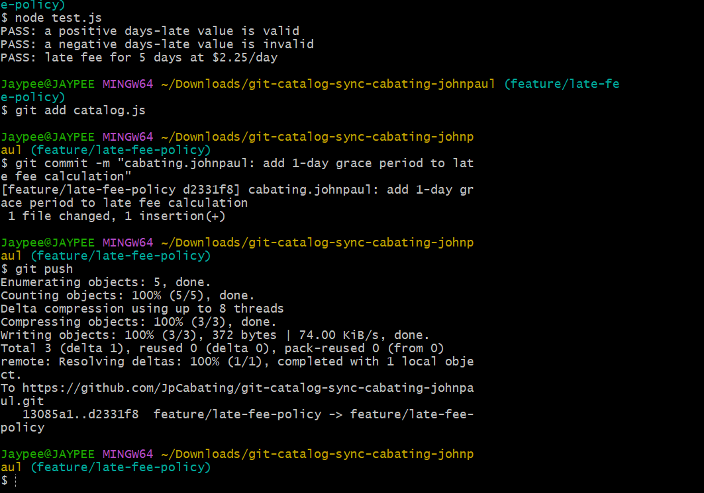
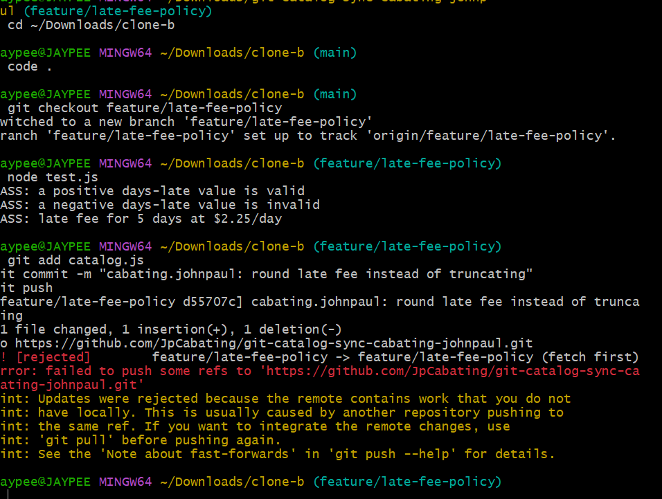
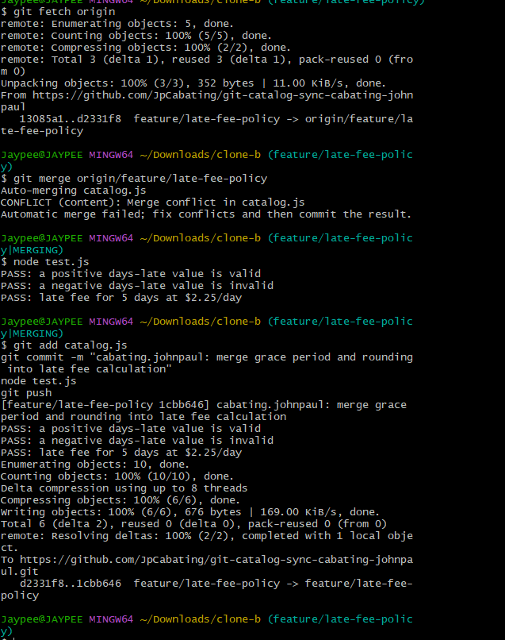
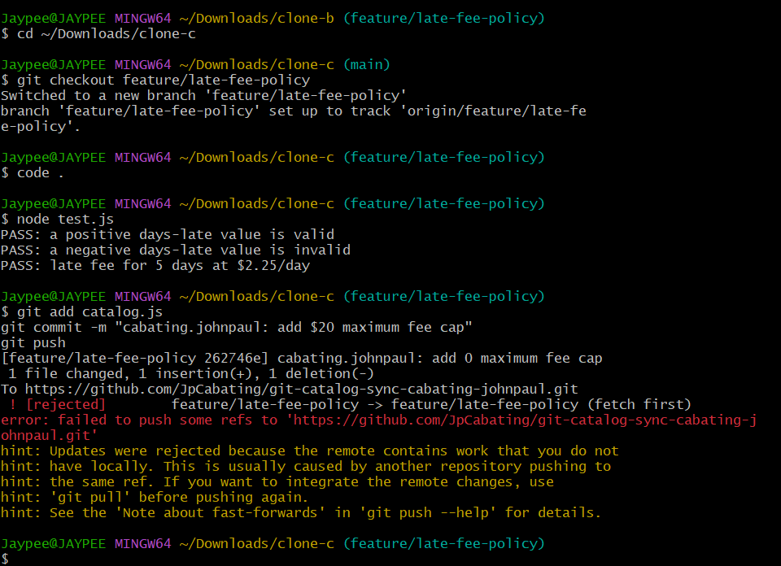
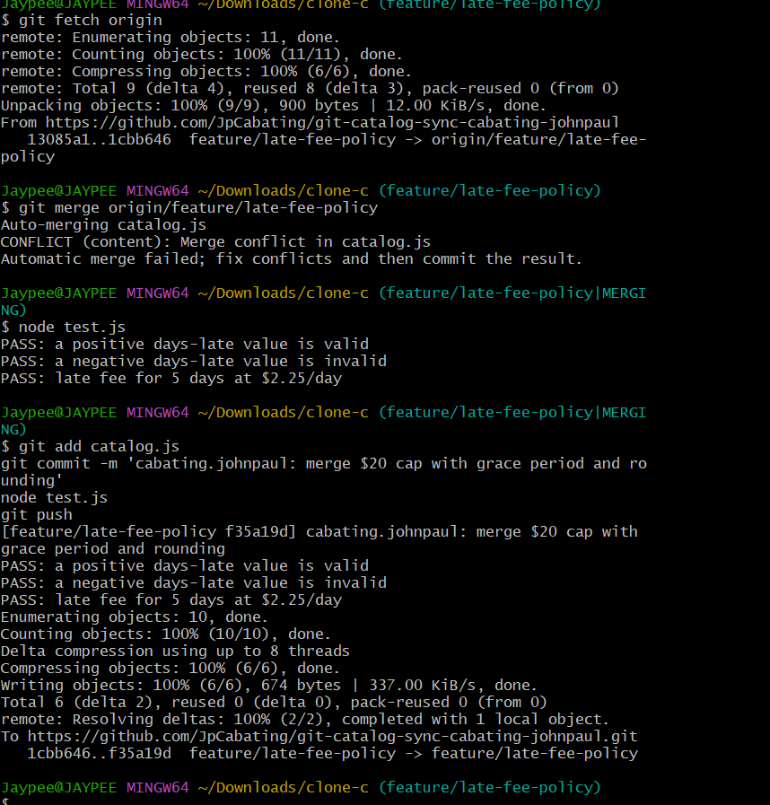
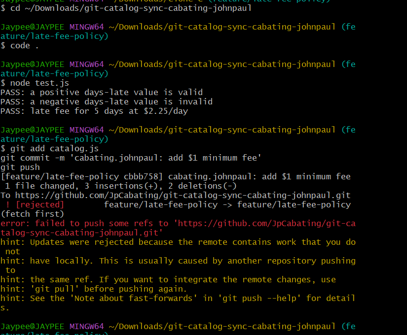
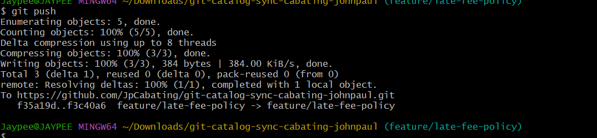

# WORKFLOW.md — git-catalog-sync-cabating-johnpaul

This document walks through each task in the late fee policy sync lab, with screenshot evidence and answers to the workflow questions.

## Task 1: Push a change from Clone A

Added a 1-day grace period to `calculateLateFee`, committed, and pushed from Clone A.



## Task 2: Diverge from Clone B — and get rejected

Clone B (without fetching Clone A's push) added rounding instead of truncating. Commit succeeded, but the push was rejected since the remote had moved.



## Task 3: Reconcile with a merge

Fetched and merged in Clone B. Resolved the conflict so grace period and rounding both survive. Tests passed, pushed.



## Task 4: Bring in the third contributor — and get rejected again

Clone C (still at the original state) added a $20 maximum fee cap. Commit succeeded, push rejected — the branch had moved twice since Clone C last saw it.



## Task 5: Reconcile a three-way merge

Fetched and merged in Clone C. Resolved the conflict so grace period, rounding, and the $20 cap all survive together. Tests passed, pushed.



## Task 6: Diverge a third time — reconcile with a rebase

Back in Clone A (without fetching since Task 1), added a $1 minimum fee. Commit succeeded, push rejected.



Resolved with `git fetch` + `git rebase` instead of merge. Resolved the conflict so all four behaviors survive, continued the rebase, and pushed without needing force.



## Task 7: Merge into main, tag, and document

Merged `feature/late-fee-policy` into `main`, pushed, tagged the final commit `v1.0-synced`, and pushed the tag.

---

## Workflow Questions

### 1. Walk through the final `calculateLateFee` function and name which contributor's change is responsible for each part.

```javascript
function calculateLateFee(daysLate, ratePerDay) {
  if (daysLate <= 1) return 0;
  let fee = Math.round(daysLate * ratePerDay);
  fee = Math.min(20, fee);
  fee = Math.max(1, fee);
  return fee;
}
```

- `if (daysLate <= 1) return 0;` = Task 1 (Clone A) — grace period, no fee if 1 day late or less.
- `Math.round(...)` = Task 2 (Clone B) — rounds the fee instead of truncating it.
- `Math.min(20, fee)` = Task 4 (Clone C) — caps the fee at $20 max.
- `Math.max(1, fee)` = Task 6 (Clone A) — sets $1 as the minimum fee.

### 2. Compare Task 3's two-way conflict to Task 5's three-way conflict — what got harder with a third line of work?

Task 3 only had two changes to combine, so it was simple to see both sides and merge them. Task 5 had three changes overlapping at once, so I had to think about the right order to apply them in, not just combine lines. It was harder to make sure all three rules worked together instead of one canceling another out.

### 3. What's the actual difference between how you resolved Task 5 (merge) and Task 6 (rebase)?

Task 5 used `git merge`, which joins two histories together and creates a merge commit showing both branches came together. Task 6 used `git rebase`, which replays my commit on top of the newest changes, making the history look like one straight line instead of separate branches joining. The final code ended up similar either way, but merge keeps the real history, while rebase makes it look cleaner and linear.

### 4. If this were a real team of three, what one process change would have prevented all three rejected pushes?

Everyone pulling the latest changes before starting new work (and again before pushing) would have prevented all three rejections. Each rejection happened because someone was working on outdated code without checking for updates first. Making "pull before you start" a team rule would stop conflicts from showing up as a surprise at push time.